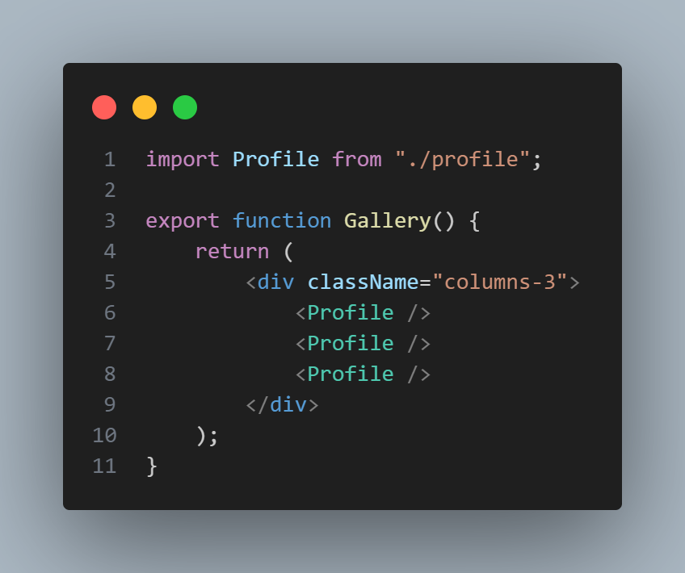
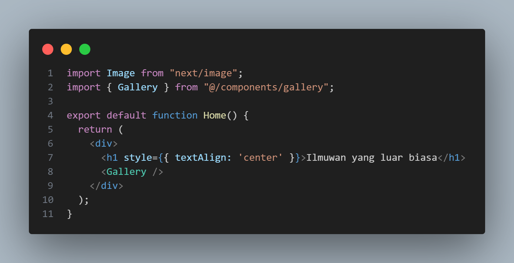
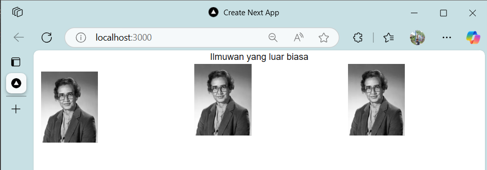
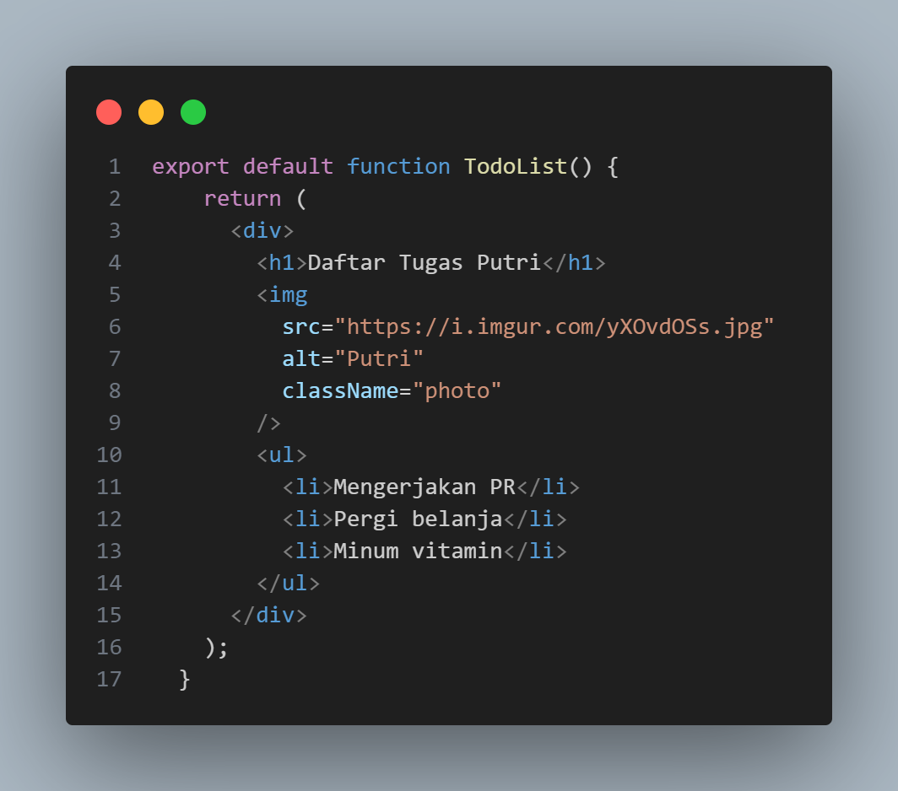
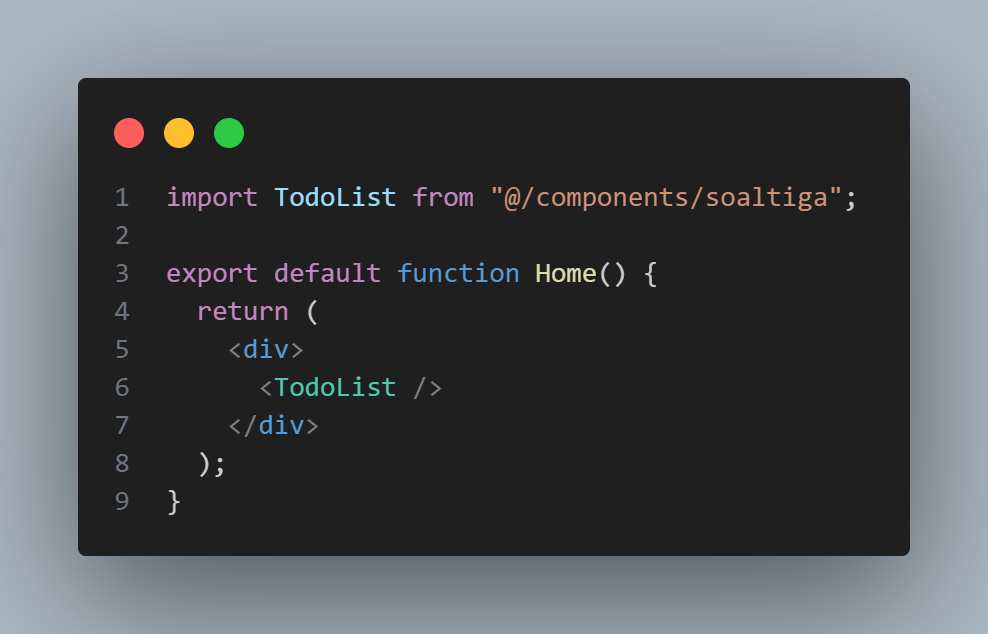
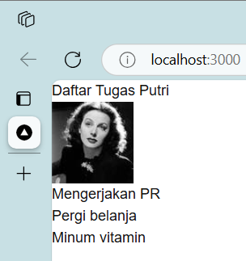
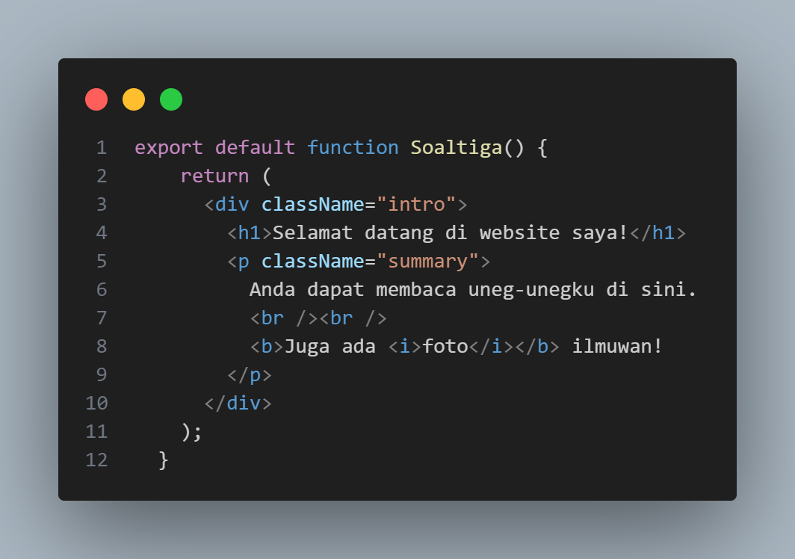
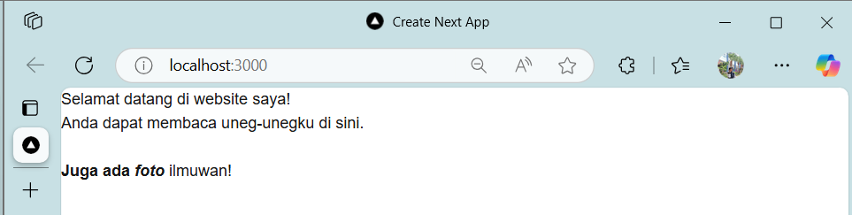
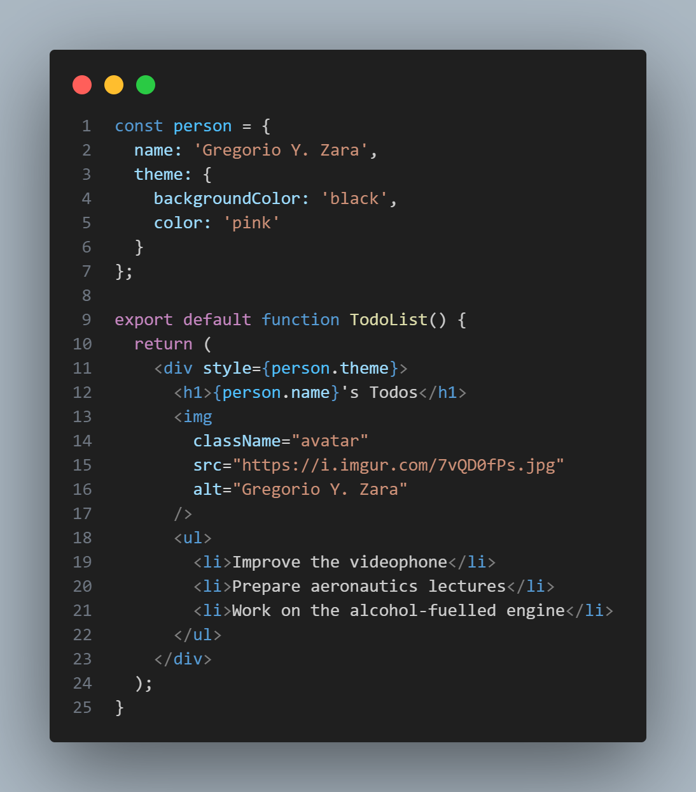

# **Laporan Praktikum: Components, JSX, dan Props**
---

## Nama  : Yogianna Nur Febrianti
## Kelas : TI 3A
## Absen : 23

### Praktikum 1: Mendefinisikan Komponen

### Langkah 1: Buat Folder Baru

Buatlah folder baru bernama 03-belajar-komponen lalu di dalam folder tersebut, jalankan terminal dengan mengetikkan perintah berikut:


Perhatian: Anda perlu membuat repo baru di GitHub dengan nama yang sama yaitu 03-belajar-komponen.

### Langkah 2: Buat Komponen Baru

Buatlah folder baru dan file baru di src/components/profile.tsx lalu ketik kode berikut ini.


Kode tersebut menggunakan komponen Image bawaan dari Next.js.

Komponen React adalah fungsi JavaScript biasa, tetapi nama mereka harus dimulai dengan huruf kapital atau tidak akan berfungsi!

### Langkah 3: Import Komponen

Lakukan import komponen Profile ke src/app/page.tsx

```
import Profile from "../components/profile";
```

### *Soal 1*

Ubah isi kode Home() sehingga dapat tampil seperti berikut dengan memanfaatkan komponen Profile() yang tadi sudah dibuat dari langkah 1 tersebut!

Capture hasilnya dan buatlah laporan di README.md. Jelaskan apa yang telah Anda pelajari dan bagaimana Anda solve error tersebut?


**Yang saya pelajari:**
1. Membuat dan menggunakan komponen React
2. Mengatur layout menggunakan flexbox CSS
3. Menggunakan next/image untuk optimasi gambar
4. Konfigurasi domain gambar di Next.js

**Cara mengatasi error:**
1. Error "hostname not configured": Menambahkan domain 'i.imgur.com' di next.config.js
2. Error layout: Menggunakan flexbox untuk mengatur posisi gambar
3. Error styling: Menambahkan text-align center untuk judul

### Praktikum 2: Mengimpor dan Mengekspor Komponen

### Langkah 1: Buat Komponen Baru

Buatlah file baru di src/components/gallery.tsx berisi kode seperti berikut:



### Langkah 2: Impor Komponen

Lakukan impor komponen di src/app/page.tsx seperti berikut ini. Hapus kode komponen lama Profile, lalu sesuaikan dengan komponen baru Gallery yang telah dibuat.



### *Soal 2*

Capture hasilnya dan buatlah laporan di README.md. Jelaskan apa yang telah Anda pelajari dan bagaimana tampilannya saat ini?



**Yang saya pelajari:**
1. Cara membuat komponen terpisah (Gallery) yang menggunakan komponen lain (Profile)
2. Penggunaan export dan import untuk berbagi komponen
3. Penggunaan className untuk styling dengan Tailwind CSS
4. Konsep komponen reusable dalam React

**Tampilan saat ini:**
- Menggunakan class columns-3 dari Tailwind untuk layout 3 kolom
- Komponen Gallery membungkus 3 komponen Profile
- Struktur komponen menjadi lebih modular dan maintainable
- Layout tetap responsive dengan Tailwind CSS

### Menulis Markup dengan JSX

Mengubah atribut di markup yang sudah ada bisa menjadi membosankan. Disarankan untuk menggunakan converter untuk mengubah HTML dan SVG-mu menjadi JSX. Konverter sangat berguna dalam praktiknya, namun tetap ada baiknya Anda perlu memahami kodenya sehingga Anda dapat menulis JSX sendiri dengan nyaman.

Berikut hasil jadinya:

- components/soaltiga.tsx



- app/page.tsx



- hasilnya :



### *Soal 3*

Silakan perbaiki kode JSX berikut ini. Anda boleh menggunakan konverter atau perbaiki secara manual.

- components/soaltiga.tsx



#### Perbaikan yang Dilakukan:

1. **Menambahkan Parent Element**
   - Membungkus semua konten dalam `<div className="intro">`
   - Memastikan hanya ada satu root element

2. **Menutup Semua Tag**
   - Mengganti `<br>` menjadi `<br />`
   - Memastikan semua tag memiliki closing tag

3. **Menggunakan camelCase**
   - Mengubah `class` menjadi `className`
   - Mengikuti konvensi penamaan React

4. **Memperbaiki Nested Tags**
   - Memastikan tag bersarang ditutup dengan benar
   - Menghindari tag yang tumpang tindih

- hasilnya :



### Praktikum 3: Menggunakan JSX dinamis

### Langkah 1: Buat Komponen Baru

Buatlah file baru di src/components/todolist.tsx berisi kode seperti berikut:


### *Soal 4*

Kode di atas masih terdapat error, silakan diperbaiki.



**Error yang diperbaiki:**
1. `{person}` tidak bisa langsung dirender karena merupakan object
2. Mengakses properti name dengan `{person.name}`
